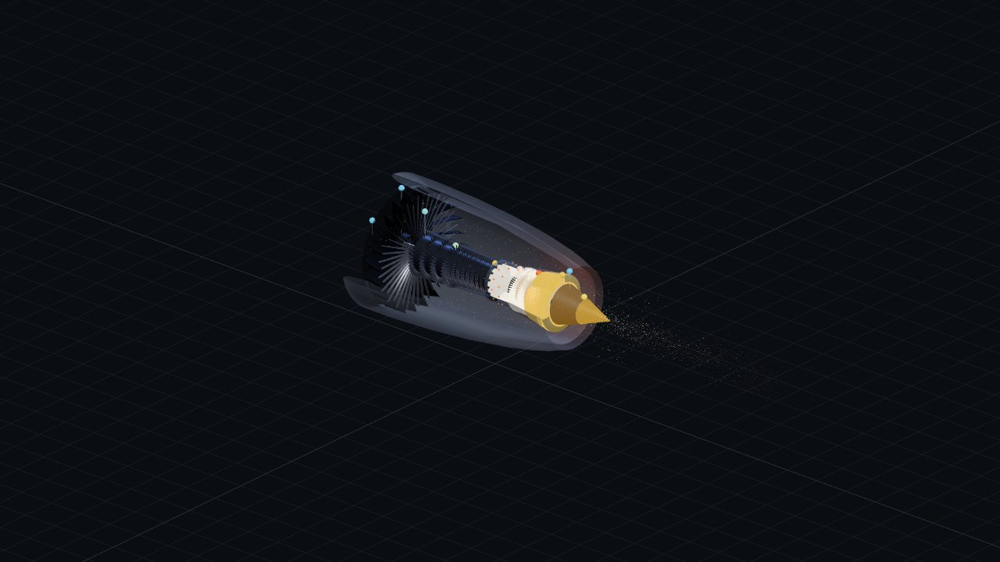

# GE90-Inspired Turbofan — Interactive Cutaway Simulator



An interactive, browser-based **educational** simulation of a GE90-115B-inspired
high-bypass, two-spool axial-flow turbofan. It shows — in a transparent,
museum-style cutaway — how air flows from inlet to exhaust, and runs a simplified
but physically-traceable thermodynamic cycle live as you move the throttle,
altitude, Mach, and temperature controls.

> **Disclaimer:** This is an educational, simplified, GE90-*inspired* model. It is
> **not** manufacturer data, **not** CFD, and **not** suitable for design,
> maintenance, or operational use. All values are public, rounded teaching targets.

## Quick start

```bash
npm install
npm run dev      # http://localhost:5173
```

Other scripts:

```bash
npm run build    # type-check + production build
npm run preview  # serve the production build
npm test         # run the simulation unit tests (Vitest)
```

## What you can do

- **Orbit / pan / zoom** the engine with the mouse (left-drag orbit, right/middle-drag
  pan, wheel zoom). Default view is an orthographic 3/4 isometric "technical" angle.
- **Camera presets**: Full Engine Isometric, Front Fan, Compressor Cutaway,
  Combustor/Turbine, Exhaust, Top Cutaway — plus a reset button, and
  Orthographic ⇄ Perspective toggle. Double-click a station marker or section
  label to fly the camera to it.
- **View modes**: Full, Transparent, Cutaway (default), Exploded.
- **Controls**: Throttle (0–100 %), Altitude (0–40,000 ft), Mach (0–0.85),
  ISA temperature offset (−20…+20 °C), plus overlay toggles (station labels,
  section labels, flow particles, temperature colors, velocity vectors),
  pause, reset-to-takeoff, reset-to-cruise.
- **Read** live thrust, spool speeds (N1/N2), mass flows, fuel flow, bypass ratio,
  overall pressure ratio, compressor exit P/T, turbine inlet temperature, EGT,
  exhaust velocities, TSFC, and surge margin — with warnings for over-temperature,
  low surge margin, infeasible operating points, and flameout risk.
- **Click a station marker** (0, 2, 13, 25, 3, 4, 45, 5, 8, 18) for a card with
  pressure, temperature, velocity, mass flow, and a student-friendly explanation.

## Architecture

```
src/
  sim/            Pure, framework-free physics (unit-tested)
    constants.ts      gas properties, efficiencies, ISA & numerical guards
    units.ts          SI <-> ft/lbf/°C/kPa conversions + clamp/lerp
    atmosphere.ts     ISA model (troposphere + stratosphere), 0–40k ft
    stageModel.ts     component blocks: compress / burn / expand turbine / nozzle
    engineModel.ts    quasi-1D Brayton cycle assembly + thrust calibration
    spoolDynamics.ts  first-order spool inertia + transient surge penalty
    validation.ts     full-envelope NaN/Inf sweep
    types.ts          shared data contracts
  data/
    defaultEngineConfig.ts   GE90-inspired design targets
    engineLayout.ts          single source of truth for positions/radii
    educationalCopy.ts       station/section explanations + disclaimer
  geometry/        Procedural Three.js geometry (solid lofted blades, nacelle, …)
  util/            temperature→color scale, camera presets
  store/           Zustand store (inputs → engine solution, live spools, view)
  components/      React-three-fiber scene + DOM control/readout/chart panels
  tests/           Vitest: atmosphere, units, engine model trends + robustness
```

### Physics model (in one paragraph)

The inlet ram-compresses freestream air; the fan raises total pressure for both
the large **bypass** stream (which produces most of the thrust) and the **core**
stream. The core passes through a 4-stage booster and 9-stage HPC, reaching the
overall pressure ratio (~42 at takeoff). Fuel burns in the combustor to the target
turbine-inlet temperature (energy-balance fuel-air ratio). The 2-stage HPT extracts
exactly the work the HPC needs; the 6-stage LPT extracts the work the fan + booster
need (two-spool energy balance). The core and bypass nozzles convert remaining
enthalpy into jet velocity, and momentum gives thrust. Thrust is calibrated so
sea-level static, 100 % throttle, ISA produces ~513 kN (~115,300 lbf). Every
equation lives in `sim/` and is commented for students to read.

## Tech stack

TypeScript · React 18 · Vite · Three.js · @react-three/fiber · @react-three/drei ·
Zustand · Vitest. No backend, no proprietary assets — all geometry is generated
procedurally.
