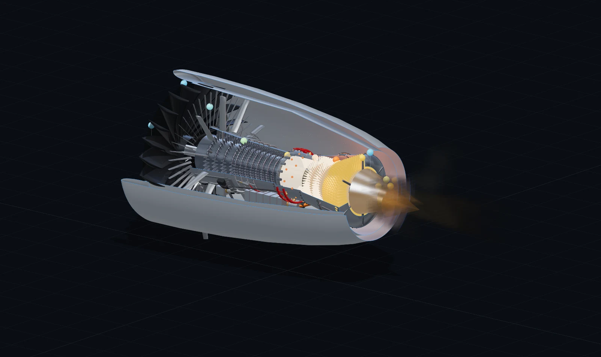

# GE90-115B Turbofan — Interactive Cutaway Simulator



An interactive, browser-based **educational** simulation of the GE90-115B
high-bypass, two-spool axial-flow turbofan. The engine boots **cold and dark**
and is started exactly the way a 777 crew does it: APU bleed up, START selector,
fuel control to RUN at 22% N2, light-off, starter cutout near idle — monitored
on EICAS-style gauges with the real certified limits. The thermodynamic cycle is
calibrated against the **EASA Type Certificate Data Sheet** and the **ICAO
Emissions Databank** (513.9 kN, BPR 7.1, OPR 42, N1 100% = 2,355 rpm,
N2 100% = 9,332 rpm, EGT limits 1,090/750 °C), and a sub-idle torque-balance
model reproduces the published start timeline (~70 s to a 66% N2 idle).

> **Disclaimer:** This is an educational, simplified model. It is **not**
> manufacturer data, **not** CFD, and **not** suitable for design, maintenance,
> or operational use. Values are public certified limits and measured data
> points where available, flagged estimates everywhere else (see
> [docs/NEXT_LEVEL_PLAN.md](docs/NEXT_LEVEL_PLAN.md) for sources).

## Quick start

```bash
npm install
npm run dev      # http://localhost:5173
```

Other scripts:

```bash
npm run build    # type-check + production build
npm run preview  # serve the production build
npm test         # run the simulation unit tests (Vitest)
```

## Project roadmap

See [Future Features and Realism Roadmap](docs/FUTURE_FEATURES.md) for completed
realism milestones, work in progress, and prioritized future improvements.

## The Learning Platform (2026-07)

Built for three audiences — high-school explorers, propulsion students, and
engineers — selectable as **Audience tiers** (Explore / Course / Engineering):

- **Guided lessons**: five narrated tours that drive the live simulator —
  "How a turbofan makes thrust", the cold-and-dark start, the Brayton cycle
  station by station, the surge lab (it really surges), and the oil/cooling/
  FADEC life-support tour.
- **Challenges judged by the physics**: gentle start (EGT < 700 °C), margin
  keeper (100% N2 without eating the surge margin), hot-day derate — every
  one provably winnable, with the obvious wrong approach provably losing.
- **Real physics**: torque-balance spool dynamics (temperature leads, speed
  follows; the core responds before the fan), a compressor map with real
  speed lines generated from the cycle itself, and compressor surge as a
  genuine event — bang, flame belch, thrust pops, ENG SURGE latch — via the
  "VBV fail closed" training scenario.
- **Anatomy tools**: 12 independently toggleable system layers, a section cut
  (slice the engine along any axis), an assembly-tree explorer with story
  cards and fly-to camera, secondary-flow particles (the oil circuit, VBV
  dump air, HPT cooling air), and a live T–s diagram drawn by the running
  engine.
- **Failure injection**: bird strike (vibration, EGT spike, rippling thrust)
  and a service-age slider that erodes the EGT margin like real time-on-wing.
- **Classroom share links**: one URL restores the exact scenario, view, tier
  and section cut for every student.
- **A 29-term glossary** written in the sim's own conventions, limit-explainer
  tooltips on the EICAS gauges, and "the math, live" — textbook equations
  with this moment's numbers substituted in.

## What you can do

- **Start the engine for real**: flip out the ENGINE START panel, switch the APU
  on (25 psi bleed minimum), rotate the START/IGNITION selector, move the fuel
  control to RUN, and watch the EEC sequence the start — fuel at 22% N2,
  light-off EGT rise, ignition off at 56%, starter cutout at 63%, the red
  start-limit line disappearing at stable idle. Autostart aborts hot/hung/
  no-light starts and retries with both igniters; switch AUTOSTART off and
  put the fuel in early to cook a hot start yourself.
- **Shut it down** (fuel control to CUTOFF) and watch the core coast to a stop
  in ~90 s while the giant fan windmills for minutes.
- **Spot the hardware**: accessory gearbox + starter under the core, staged fuel
  manifolds feeding 30 nozzle pigtails, igniter leads, VSV actuator rings
  (they move with N2), the 10 VBV doors standing open during the start,
  bolted case flanges, borescope ports, the FADEC and its harnesses — all
  color-coded to MIL-STD-1247 (fuel red, oil yellow, pneumatic orange).
- **Orbit / pan / zoom** the engine with the mouse (left-drag orbit, right/middle-drag
  pan, wheel zoom). Default view is an orthographic 3/4 isometric "technical" angle.
- **Camera presets**: Full Engine Isometric, Front Fan, Compressor Cutaway,
  Combustor/Turbine, Exhaust, Top Cutaway — plus a reset button, and
  Orthographic ⇄ Perspective toggle. Double-click a station marker or section
  label to fly the camera to it.
- **View modes**: Full, Transparent, Cutaway (default), Exploded.
- **Controls**: Throttle (0–100 %), Altitude (0–40,000 ft), Mach (0–0.85),
  ISA temperature offset (−20…+20 °C), plus overlay toggles (station labels,
  section labels, flow particles, temperature colors, velocity vectors),
  pause, reset-to-takeoff, reset-to-cruise.
- **Hear** procedural engine audio driven by live spool speed, mass flow, thrust,
  fuel flow, and exhaust velocity, with layered fan/compressor tones and staged
  low-frequency jet roar.
- **Read** live thrust, spool speeds (N1/N2), mass flows, fuel flow, bypass ratio,
  overall pressure ratio, compressor exit P/T, turbine inlet temperature, EGT,
  exhaust velocities, TSFC, and surge margin — with warnings for over-temperature,
  low surge margin, infeasible operating points, and flameout risk.
- **Click a station marker** (0, 2, 13, 25, 3, 4, 45, 5, 8, 18) for a card with
  pressure, temperature, velocity, mass flow, and a student-friendly explanation.

## Architecture

```
src/
  sim/            Pure, framework-free physics (unit-tested)
    constants.ts      gas properties, efficiencies, ISA & numerical guards
    units.ts          SI <-> ft/lbf/°C/kPa conversions + clamp/lerp
    atmosphere.ts     ISA model (troposphere + stratosphere), 0–40k ft
    stageModel.ts     component blocks: compress / burn / expand turbine / nozzle
    engineModel.ts    quasi-1D Brayton cycle assembly + thrust/EGT calibration
    spoolDynamics.ts  first-order spool inertia (running regime) + surge penalty
    startSequence.ts  sub-idle torque balance: starter, light-off, EEC autostart
                      protections, shutdown coastdown, windmilling
    validation.ts     full-envelope NaN/Inf sweep
    types.ts          shared data contracts
  data/
    defaultEngineConfig.ts   GE90-inspired design targets
    engineLayout.ts          single source of truth for positions/radii
    educationalCopy.ts       station/section explanations + disclaimer
  geometry/        Procedural Three.js geometry (solid lofted blades, nacelle, …)
  audio/           Procedural Web Audio engine sound synthesis
  util/            temperature→color scale, camera presets
  store/           Zustand store (inputs → engine solution, live spools, view)
  components/      React-three-fiber scene + DOM control/readout/chart panels
  tests/           Vitest: atmosphere, units, engine model trends + robustness
```

### Physics model (in one paragraph)

The inlet ram-compresses freestream air; the fan raises total pressure for both
the large **bypass** stream (which produces most of the thrust) and the **core**
stream. Each stream tracks its own spool — the bypass follows the fan, the core
follows corrected N2 (W·δ/√θ) — so the **bypass ratio is a derived result**
(≈7.1 at takeoff, matching the ICAO-measured value). The core passes through a
4-stage booster and 9-stage HPC to OPR ~42; fuel burns to the target
turbine-inlet temperature (energy-balance fuel-air ratio); the 2-stage HPT
drives the HPC and the 6-stage LPT drives the fan + booster (two-spool energy
balance); nozzles convert the remaining enthalpy into jet velocity and momentum
gives thrust, calibrated to the certified 513.9 kN takeoff rating. **Below
idle** the cycle hands over to a torque balance on the HP spool
(starter + combustion − drag), which is what makes a start, a shutdown, and a
hot start physically emerge rather than play back. Every equation lives in
`sim/` and is commented for students to read.

## Tech stack

TypeScript · React 18 · Vite · Three.js · @react-three/fiber · @react-three/drei ·
Zustand · Vitest. No backend, no proprietary assets — all geometry is generated
procedurally.
