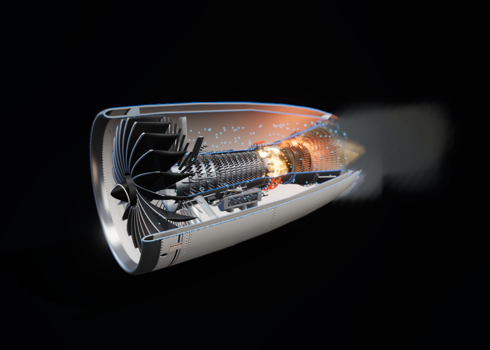
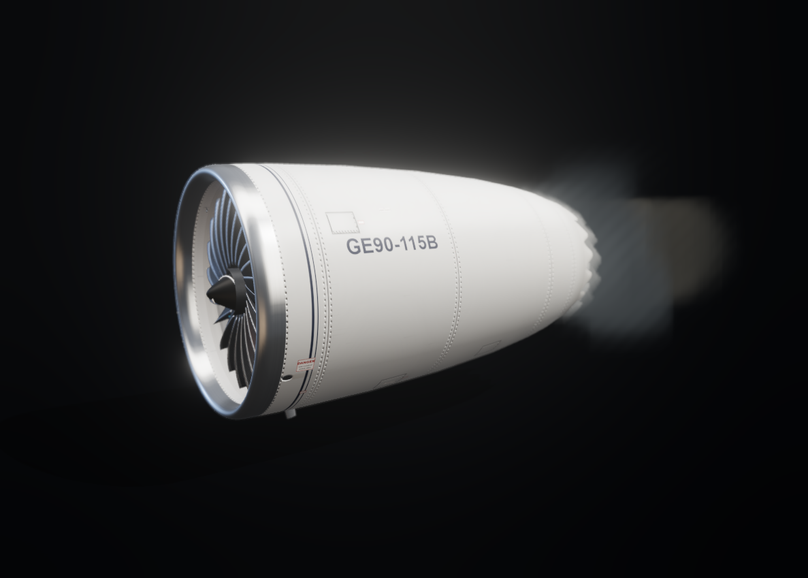
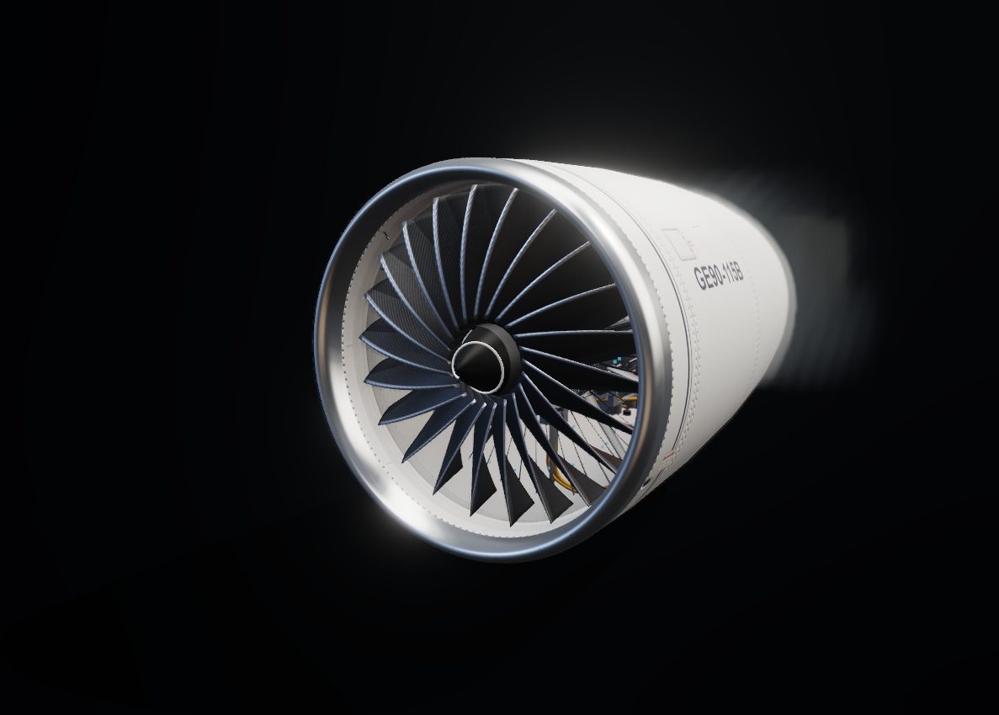
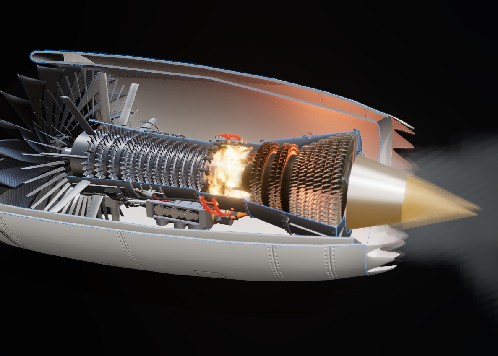
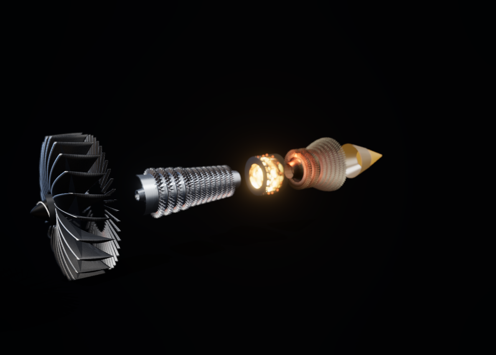
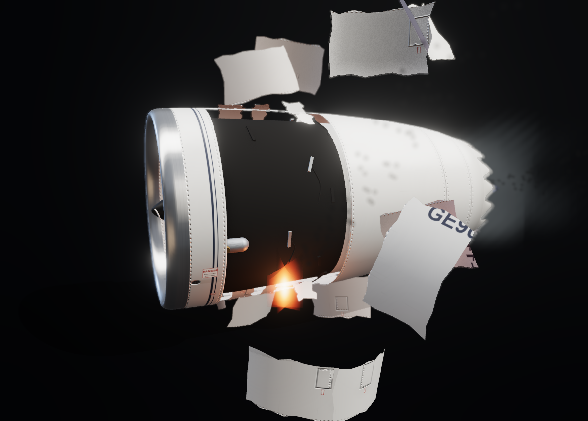

<div align="center">

# GE90‑115B Turbofan — Interactive Cutaway Simulator

**A browser-based, physically-modelled high-bypass turbofan you can start cold and dark, fly, break, and take apart.**

[](https://omessner.cloud/JetEngine)




</div>

---

An interactive **educational** simulation of the GE90‑115B high-bypass, two-spool
axial-flow turbofan — the engine that powers the Boeing 777‑300ER and holds the
record as the most powerful jet engine ever certified.

It is not an animation. The engine boots **cold and dark** and is started the way
a 777 crew starts it: APU bleed up, START selector, fuel control to RUN at 22 % N2,
light-off, starter cutout near idle. The thermodynamic cycle is calibrated against
the **EASA Type Certificate Data Sheet** and the **ICAO Emissions Databank**, and a
sub-idle torque-balance model makes the start *emerge* from physics rather than
play back from a script — so a hot start, a hung start, and a compressor surge are
things that **happen to you**, not cutscenes.

Every piece of 3D geometry and every texture is generated procedurally in code.
There are no model files, no texture assets, and no network fetches.

| | |
|---|---|
| **Takeoff thrust** | 513.9 kN (115,300 lbf) `[TCDS]` |
| **Fan** | 3.25 m diameter, 22 wide-chord composite blades |
| **Spools** | 4-stage booster / 9-stage HPC / 2-stage HPT / 6-stage LPT |
| **Cycle** | OPR 42, BPR 7.1 (derived, not assumed) `[ICAO]` |
| **Redlines** | N1 2,355 rpm · N2 9,332 rpm · EGT 1,090 / 750 °C |

> [!IMPORTANT]
> **This is an educational, simplified model.** It is **not** manufacturer data,
> **not** CFD, and **not** suitable for design, maintenance, or operational use.
> Values are public certified limits and measured data points where available,
> and flagged estimates (`[EST]`) everywhere else — see
> [docs/NEXT_LEVEL_PLAN.md](docs/NEXT_LEVEL_PLAN.md) for sources.

## Gallery

| Exterior — procedural painted skin | Fan face — 22 composite blades |
|---|---|
|  |  |
| Panel seams, countersunk rivet rows, access doors, service placards and a bare-metal anti-ice lip — all painted in code, no texture files. | Carbon-twill blades with titanium leading-edge sheaths, behind a fat elliptical inlet lip. |

| Hot section at takeoff | Exploded anatomy |
|---|---|
|  |  |
| The combustor really burns: a shader flame whose violence tracks fuel flow, feeding a heat-stained turbine. | Pull the modules apart along the axis and look at each one. |

<div align="center">

### Fan blade off — the certification event, simulated



Release a fan blade at takeoff power and watch what the certification test proves:
the case **contains** it, the cowl doors shatter and depart, the engine surges,
flames out, and shakes itself down to a stop — while EICAS latches ENG FAIL, low
oil pressure and severe vibration. Or burst a rotor disk instead, and watch an
**uncontained** failure punch through the nacelle and start a fire only the fire
handle will put out.

</div>

## Quick start

```bash
npm install
npm run dev      # http://localhost:5173/JetEngine/
```

```bash
npm run build    # type-check + production build
npm run preview  # serve the production build
npm test         # 102 unit tests (Vitest)
```

## What you can do

### Start it for real
Flip out the ENGINE START panel, switch on the APU (25 psi bleed minimum), rotate
the START/IGNITION selector, and move the fuel control to RUN. The EEC sequences
the rest — fuel at 22 % N2, light-off EGT rise, ignition off at 56 %, starter
cutout at 63 %, the red start-limit line vanishing at stable idle. Autostart
detects hot, hung and no-light starts and retries on both igniters; switch
AUTOSTART **off** and introduce fuel early to cook a hot start yourself. Cut the
fuel and the core coasts down in ~90 s while the giant fan windmills for minutes.

### Break it
- **Fan blade off** and **uncontained disk burst**, behind a guarded switch:
  ragged cowl shreds, an exposed burning bay, oil-fed fire, and a fire handle
  that actually secures the engine.
- **Compressor surge** as a genuine event — bang, flame belch, thrust pops, ENG
  SURGE latch — reachable through the "VBV fail closed" training scenario.
- **Bird strike** and a **service-age slider** that erodes EGT margin exactly like
  real time-on-wing.

### Take it apart
- **12 toggleable system layers** — nacelle, structure, rotors, stators,
  combustor, nozzles, bearings, accessory drive, fuel & ignition, air & bleed,
  electrical & FADEC, case detail.
- **Five view modes**: Full, Transparent, Cutaway, Exploded, and Internals
  (a drive-train X-ray of shafts, bearings and the accessory gearbox).
- **Section cut** along any axis, an **assembly-tree explorer** with story cards
  and fly-to camera, and **secondary-flow particles** tracing the oil circuit,
  VBV dump air and HPT cooling air.

### Learn from it
Three **audience tiers** — Explore / Course / Engineering — progressively reveal
the analytical panels:
- **Five guided lessons** that drive the live simulator: how a turbofan makes
  thrust, the cold-and-dark start, the Brayton cycle station by station, the
  surge lab, and the oil/cooling/FADEC life-support tour.
- **Challenges judged by the physics**: gentle start (EGT < 700 °C), margin
  keeper, hot-day derate — each provably winnable, with the obvious wrong
  approach provably losing.
- A **live T–s diagram** drawn by the running engine, a **compressor map** with
  speed lines generated from the cycle itself, a **29-term glossary**, and
  "the math, live" — textbook equations with this moment's numbers in them.
- **Classroom share links**: one URL restores the exact scenario, view, tier and
  section cut for every student.

### Look at it
Procedural **ambient occlusion**, tangent-space **normal maps** derived from the
same height fields that paint the surfaces, a hand-built **studio environment**
for believable metal reflections, fitted 4096 shadow maps, and a shallow
**depth of field** in presentation mode. Plus procedural engine **audio** driven
by live spool speed, mass flow, thrust and exhaust velocity.

## Physics model, in one paragraph

The inlet ram-compresses freestream air; the fan raises total pressure for both
the large **bypass** stream (which produces most of the thrust) and the **core**
stream. Each stream tracks its own spool — the bypass follows the fan, the core
follows corrected N2 (W·δ/√θ) — so the **bypass ratio is a derived result**
(≈ 7.1 at takeoff, matching the ICAO-measured value). The core passes through a
4-stage booster and 9-stage HPC to OPR ≈ 42; fuel burns to the target
turbine-inlet temperature (energy-balance fuel–air ratio); the 2-stage HPT drives
the HPC and the 6-stage LPT drives the fan and booster (two-spool energy balance);
nozzles convert remaining enthalpy into jet velocity, and momentum gives thrust,
calibrated to the certified 513.9 kN rating. **Below idle** the cycle hands over
to a torque balance on the HP spool (starter + combustion − drag), which is what
makes a start, a shutdown and a hot start physically emerge. Above idle, a
**temperature-surplus torque balance** means temperature leads and speed follows —
the core responds before the fan, as it does in life. Every equation lives in
`src/sim/` and is commented for students to read.

## Architecture

```
src/
  sim/            Pure, framework-free physics (unit-tested, no React, no Three.js)
    engineModel.ts    quasi-1D Brayton cycle assembly + thrust/EGT calibration
    stageModel.ts     component blocks: compress / burn / expand / nozzle
    spoolDynamics.ts  torque-balance + first-order spool inertia, surge penalty
    startSequence.ts  sub-idle torque balance: starter, light-off, EEC autostart
    compressorMap.ts  speed lines + surge line generated from the cycle itself
    actuation.ts      FADEC variable-geometry schedules (VSV / VBV)
    rudEvent.ts       catastrophic failure timeline (blade off / disk burst)
    atmosphere.ts     ISA model (troposphere + stratosphere), 0–40k ft
  data/           Design targets, spatial layout, educational copy, lessons
  geometry/       Procedural Three.js geometry (blades, nacelle, casings)
  materials/      Procedural PBR: canvas-painted maps + derived normal maps
  audio/          Web Audio engine-sound synthesis
  store/          Zustand store (inputs → solution → live spools → view state)
  components/     react-three-fiber scene + DOM control/readout panels
  tests/          Vitest: 102 tests across cycle, dynamics, start, failures
```

## Fidelity notes

Honesty about where this model matches the real engine and where it doesn't:

- **The numbers are sourced.** Thrust, pressure ratios, spool speeds, EGT limits
  and the start timeline come from the EASA TCDS and ICAO databank, tagged
  `[TCDS]` / `[ICAO]` in the code. Estimates are tagged `[EST]`.
- **The chevrons are an aesthetic liberty.** The sawtooth serrations on the
  bypass nozzle are a GEnx/787-family feature — the real GE90‑115B has a plain
  trailing edge. They were added because they look superb, and they're kept
  deliberately. Everything else about the model — 3.25 m fan, 22 blades,
  513.9 kN, the 4/9/2/6 spool architecture — is GE90‑115B.
- **Geometry is "inspired by", not measured.** Proportions come from public
  photographs and cutaway drawings, not manufacturer drawings.
- **It is a 1D cycle model.** There is no CFD, no 3D flow field, and no
  blade-row aerodynamics.

## Roadmap

See [Future Features and Realism Roadmap](docs/FUTURE_FEATURES.md) for completed
milestones, work in progress, and prioritized improvements, and
[docs/IMPROVEMENT_PROGRAM.md](docs/IMPROVEMENT_PROGRAM.md) for the learning-platform
program that shaped the current feature set.

## Tech stack

TypeScript · React 18 · Vite · Three.js · @react-three/fiber · @react-three/drei ·
@react-three/postprocessing · Zustand · Vitest.
No backend, no proprietary assets — all geometry and every texture generated
procedurally at runtime.
